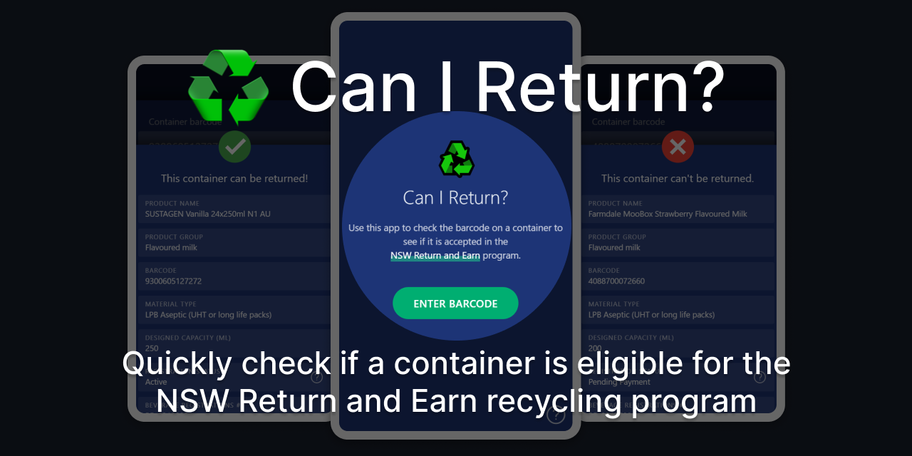

# Can I Return?

♻ Quickly check if a container is accepted in the [NSW Return and Earn](https://returnandearn.org.au/) recycling program by entering the barcode or scanning it.

This project is part of [#CreateWeekly](https://dev.to/josephuspaye/createweekly-create-something-new-publicly-every-week-in-2020-1nh9), my attempt to create something new publicly every week in 2020.

## Usage

<https://canireturn.netlify.com/>

## How it works

<!-- Uses the Return and Earn Container Search database... -->

## Contributing

See [contribution guide](CONTRIBUTING.md).

## Licence

[MIT](LICENCE)
